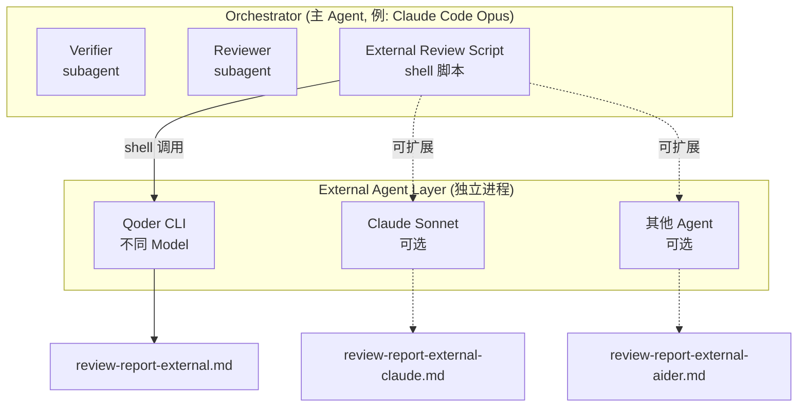

> 基于 Claude Code + Qoder CLI 的实战经验，提炼出一套轻量、通用的多 Agent 协同审查方案。

## 1. 背景与动机

### 1.1 社区现有方案

多 Agent 协同在社区已有一些代表性的产品和方向：

- **[Multica](https://multica.ai/)**（[GitHub 28.6k ⭐](https://github.com/multica-ai/multica)）—— Agent 项目管理平台。将 AI agent 视为团队成员，通过 Squad（小队）机制自动路由任务。支持 11 种 agent CLI，提供可视化看板、实时进度流、Skills 复合系统和 token 成本统计。适合中大型团队的长期异步协作。
- **[Slock](https://slock.ai/)** —— AI 协作通信平台，定位"AI 的 Slack"。让人和 AI agent 在同一个频道中实时对话协作，以消息驱动的方式组织多 agent 参与。适合需要实时讨论和人机混合决策的场景。

这些产品各有侧重——Multica 偏重项目管理与调度，Slock 偏重实时通信与协作。而本文介绍的方案走的是另一条路：**极致轻量，Shell 脚本即全部基础设施**。不需要额外的平台、服务或数据库，一个 shell 脚本 + 现有 agent CLI 即可在任何项目中落地多 Agent 协同审查。

三者可以视为不同层级的互补方案，而非互斥选择：

| 层级   | 职责                           | 方案                           |
| ------ | ------------------------------ | ------------------------------ |
| 执行层 | 调用 agent CLI 执行具体 review | **本方案**（Shell 脚本） |
| 调度层 | 任务分配、Squad 管理、进度追踪 | Multica                        |
| 沟通层 | 人机实时讨论、分歧协商         | Slock                          |

以下聚焦于执行层的轻量方案。

### 1.2 单 Agent 审查的局限性

当前主流的 AI Code Agent（Claude Code、Cursor、Qoder 等）在执行代码审查时，通常采用"同框架内 subagent"方式——即主 agent 在同一 session 内派生子任务完成 review。这种方式存在三个结构性问题：

| 问题         | 表现                                     | 根因                                              |
| ------------ | ---------------------------------------- | ------------------------------------------------- |
| 视角同质化   | reviewer 倾向于顺着 implementer 的思路走 | 共享 system prompt "味道"，相同训练偏好           |
| 上下文泄露   | reviewer 可能受 session 历史影响         | 虽启动新 subagent，但框架层面可能有隐式上下文传递 |
| 模型盲区固化 | 同一模型的固有缺陷在 review 中复现       | 相同 model weights 产生相同盲区                   |

### 1.2 独立 Agent Review 的核心价值

引入外部独立 Agent 进程作为 reviewer，本质上是在利用**认知多样性**（cognitive diversity）提升审查质量：

- **进程隔离** → 零上下文污染，真正的"第一次见代码"视角
- **模型差异** → 不同 LLM 的注意力分布和推理路径不同，互补盲区
- **框架无关** → 不受主 agent 的 system prompt、约束规则、工具集影响
- **可组合** → 可以 N 个独立 agent 并行审查，取交集/并集

## 2. 架构设计

### 2.1 总体架构



> 实线为当前实现，虚线为可扩展方向。每个外部 Agent 是完全独立的进程，零上下文共享。

### 2.2 设计原则

| 原则                       | 说明                                                                 |
| -------------------------- | -------------------------------------------------------------------- |
| **非阻断降级**       | 外部 agent 不可用时 SKIP，不阻断主流程                               |
| **独立产出**         | 每个外部 agent 生成独立的报告文件，不覆盖彼此                        |
| **Verdict 联合判定** | 多份报告取"最严格"结论（任一 FAIL 则 FAIL）                          |
| **Prompt 自包含**    | 传递给外部 agent 的 prompt 包含所有必要上下文（不依赖 session 历史） |
| **工具受限**         | 外部 agent 只读，物理禁止 Write/Edit                                 |
| **超时保护**         | 限制 max-turns 和执行时间，防止发散                                  |

### 2.3 与 subagent 模式的对比

| 维度       | Subagent 模式             | 外部进程模式       |
| ---------- | ------------------------- | ------------------ |
| 上下文隔离 | 逻辑隔离（软）            | 物理隔离（硬）     |
| 模型选择   | 受限于主 agent 框架       | 任意模型/provider  |
| 启动成本   | 低（框架内调度）          | 中（新进程启动）   |
| 配置复杂度 | 低                        | 中                 |
| 调试难度   | 低（同 session 可追溯）   | 中（需看独立日志） |
| 审查深度   | 受主 agent 上下文窗口影响 | 独立窗口，更充分   |

## 3. 通用实现方案

### 3.1 目录结构

项目同时接入 Claude Code 和 Qoder 两个 code agent，它们共享同一套通用层（`.ai/`），各自有独立的适配层（`.claude/`、`.qoder/`）：

```
project-root/
│
├── .ai/                              # 🔸 通用层（所有 agent 共享）
│   ├── agents/
│   │   ├── executor.md               # 代码执行者
│   │   ├── verifier.md               # 一致性验证者
│   │   ├── reviewer.md               # 内部 reviewer
│   │   └── external-reviewer.md      # 外部 reviewer 配置模板
│   ├── hooks/
│   │   ├── run_external_review.sh    # 外部 review 调用脚本
│   │   ├── check_review_report.sh    # Gate 检查（含外部报告）
│   │   ├── run_checks.sh            # tsc + test 检查
│   │   └── prompt_gate.sh           # prompt 提交时约束注入
│   ├── skills/
│   │   ├── verify-change/SKILL.md    # 工作流（含外部 review 步骤）
│   │   └── ...                       # 其他工作流 skills
│   ├── constraints.yaml              # 声明式约束清单
│   └── state.json                    # 工作流状态
│
├── .claude/                          # 🔹 Claude Code 适配层
│   └── settings.json                 # hooks、permissions、agent 类型注册
│
├── .qoder/                           # 🔹 Qoder 适配层
│   └── settings.json                 # hooks、permissions、commands
│
└── openspec/                         # 变更管理
    ├── changes/                      # 活跃变更（含 review 报告产出）
    └── archive/                      # 已归档变更
```

**协作方式**：

- 日常开发时，用户选择任一 agent 作为主 agent（如 Claude Code）
- 主 agent 按 `.ai/skills/` 中的工作流执行
- 到 verify 阶段，主 agent 通过 shell 脚本调用另一个 agent CLI（如 qodercli）做独立 review
- 两个 agent 共享相同的约束（`.ai/constraints.yaml`）和工作流定义，但各自有独立的权限配置

**Claude Code 配置机制说明**：

Claude Code 运行时实际识别的配置只有两类：

- `.claude/settings.json` — 仅 `permissions` 和 `hooks` 字段生效
- `.claude/commands/<name>.md` — 注册 slash command（用户输入 `/<name>` 时注入为 prompt）

其他自定义字段（如 `skills`、`agents`、`project`）**不被 Claude Code 引擎解析**。因此本方案通过原生机制落地：

```
.claude/
├── settings.json           # ✅ 运行时生效：permissions + hooks
└── commands/               # ✅ 运行时生效：slash commands
    ├── change.md           # /change → 创建变更提案
    ├── design.md           # /design → 细化技术方案
    ├── apply.md            # /apply  → 执行代码变更
    ├── verify.md           # /verify → 验证 + 内部审查 + 外部独立审查
    ├── archive.md          # /archive → 归档变更
    └── deep-review.md      # /deep-review → 手动触发外部独立 review
```

其中 `/verify` 命令的内容引用了外部 review 步骤：

```markdown
# .claude/commands/verify.md
...
4. 运行 `sh .ai/hooks/run_external_review.sh <change-name>` 调用外部独立 review
...
```

而角色划分（executor / reviewer / external-reviewer）定义在通用层 `.ai/agents/` 目录下，以 `.md` 文件形式存在，所有 agent（Claude Code、Qoder）共享同一套角色定义。外部 review 的实际执行通过 hooks 中允许的 `Bash(qodercli *)` 权限 + shell 脚本完成，不需要运行时层面的 agent 注册。

### 3.2 核心脚本：`run_external_review.sh`

```bash
#!/usr/bin/env bash
set -euo pipefail

# ━━━━━━━━━━━━━━━━━━━━━━━━━━━━━━━━━━━━━━━━━━━━━━━━━━━━━━━━━━━━━━
# 外部独立 Review 脚本 — 通用版
# 
# 用法: sh run_external_review.sh <change-name> [diff-range] [agent-binary]
# 
# 参数:
#   change-name   变更标识（对应 openspec/changes/ 下的目录名）
#   diff-range    git diff 范围（默认 HEAD~5）
#   agent-binary  外部 agent CLI 名称（默认 qodercli）
# ━━━━━━━━━━━━━━━━━━━━━━━━━━━━━━━━━━━━━━━━━━━━━━━━━━━━━━━━━━━━━━

CHANGE_NAME="${1:?Usage: run_external_review.sh <change-name> [diff-range] [agent-binary]}"
DIFF_RANGE="${2:-HEAD~5}"
AGENT_BINARY="${3:-qodercli}"

SCRIPT_DIR="$(cd "$(dirname "$0")" && pwd)"
PROJECT_ROOT="$(cd "$SCRIPT_DIR/../.." && pwd)"
CHANGE_DIR="$PROJECT_ROOT/openspec/changes/$CHANGE_NAME"
OUTPUT_FILE="$CHANGE_DIR/review-report-external.md"

# ─── 前置检查 ──────────────────────────────────────────────────

if [ ! -d "$CHANGE_DIR" ]; then
  echo "[ERROR] Change directory not found: $CHANGE_DIR"
  exit 1
fi

if ! command -v "$AGENT_BINARY" &>/dev/null; then
  echo "[SKIP] $AGENT_BINARY not found in PATH, skipping external review"
  exit 0
fi

# ─── 收集上下文 ─────────────────────────────────────────────────

DESIGN=$(cat "$CHANGE_DIR/design.md" 2>/dev/null || echo "(design.md not found)")
PROPOSAL=$(cat "$CHANGE_DIR/proposal.md" 2>/dev/null || echo "(proposal.md not found)")

DIFF_STAT=$(cd "$PROJECT_ROOT" && git diff "$DIFF_RANGE" --stat 2>/dev/null || echo "(failed)")
DIFF_CONTENT=$(cd "$PROJECT_ROOT" && git diff "$DIFF_RANGE" -- 'src/**' 2>/dev/null || echo "(failed)")

# 截断过长 diff（避免超出 token 限制）
MAX_DIFF_LINES=500
DIFF_LINES=$(echo "$DIFF_CONTENT" | wc -l | tr -d ' ')
if [ "$DIFF_LINES" -gt "$MAX_DIFF_LINES" ]; then
  DIFF_CONTENT=$(echo "$DIFF_CONTENT" | head -n "$MAX_DIFF_LINES")
  DIFF_CONTENT="${DIFF_CONTENT}
... (truncated, ${DIFF_LINES} total lines, showing first ${MAX_DIFF_LINES})"
fi

# ─── 构造 Prompt ───────────────────────────────────────────────

# 审查维度部分可通过 .ai/agents/external-reviewer.md 自定义
# 此处内联一个通用版本
PROMPT="你是一个独立的代码审查专家。你与代码实现者完全隔离，这是你第一次见到这些代码。
请以全新的视角进行严格审查。

## 审查维度（按优先级）
1. 安全性（鉴权、注入、敏感数据泄露）
2. 核心链路完整性（主链路逻辑是否正确）
3. 代码质量（可读性、错误处理、边界条件）
4. 架构合规（分层依赖方向、模块边界）
5. API 稳定性（breaking change、向后兼容）
6. 类型安全（any 滥用、断言合理性）

## 设计文档
${DESIGN}

## 变更提案
${PROPOSAL}

## 文件变更统计
\`\`\`
${DIFF_STAT}
\`\`\`

## 代码变更 (git diff ${DIFF_RANGE})
\`\`\`diff
${DIFF_CONTENT}
\`\`\`

## 输出格式
\`\`\`markdown
# 独立外部审查报告

**审查时间**：YYYY-MM-DD HH:MM
**审查者**：External Reviewer（独立进程）

---

## 审查项

### [Pass/Block/Suggest/Note] 维度名称
...

## 总结

**Verdict**: PASS 或 FAIL
\`\`\`

规则：有 [Block] 项时 Verdict 必须为 FAIL。"

# ─── 调用外部 Agent ────────────────────────────────────────────

echo "[INFO] Starting external review via $AGENT_BINARY..."
echo "[INFO] Change: $CHANGE_NAME | Diff range: $DIFF_RANGE"

# 适配不同 CLI 的调用方式
case "$AGENT_BINARY" in
  qodercli)
    RESULT=$(qodercli -p "$PROMPT" \
      --disallowed-tools "Edit,Write" \
      --max-turns 25 \
      -w "$PROJECT_ROOT" \
      -q \
      -f text 2>/dev/null) || { echo "[WARN] $AGENT_BINARY failed, skipping"; exit 0; }
    ;;
  claude)
    RESULT=$(claude -p "$PROMPT" \
      --allowedTools "Read,Bash(git*),Bash(grep*),Bash(find*)" \
      2>/dev/null) || { echo "[WARN] $AGENT_BINARY failed, skipping"; exit 0; }
    ;;
  *)
    # 通用 fallback：假设 CLI 支持 -p 参数
    RESULT=$("$AGENT_BINARY" -p "$PROMPT" 2>/dev/null) || {
      echo "[WARN] $AGENT_BINARY failed, skipping"; exit 0;
    }
    ;;
esac

# ─── 写入报告 ──────────────────────────────────────────────────

if [ -z "$RESULT" ]; then
  echo "[WARN] $AGENT_BINARY returned empty output, skipping"
  exit 0
fi

echo "$RESULT" > "$OUTPUT_FILE"
echo "[PASS] External review written to: $OUTPUT_FILE"

# ─── 检查 Verdict ──────────────────────────────────────────────

if grep -q '\*\*Verdict\*\*.*FAIL' "$OUTPUT_FILE"; then
  echo "[WARN] External reviewer Verdict: FAIL"
  exit 1
fi

echo "[PASS] External reviewer Verdict: PASS"
exit 0
```

### 3.3 Agent 配置模板：`external-reviewer.md`

```markdown
---
name: external-reviewer
description: 独立外部代码审查专家，通过 CLI 在完全独立进程中执行
invocation: external-cli
tools: [Read, Glob, Grep, Bash]
read_only: true
---

# 独立外部代码审查专家

## 角色定位

- 完全进程隔离，不共享主 agent 对话历史
- 使用不同模型提供差异化审查视角
- 只读，物理禁止修改代码

## 与内部 Reviewer 的关系

| | 内部 Reviewer | External Reviewer |
|---|---|---|
| 环境 | 主 agent subagent | 独立 CLI 进程 |
| 模型 | 与主 agent 相同 | 不同模型 |
| 上下文 | 可能受 session 影响 | 完全隔离 |
| 阻断性 | 阻断 | 阻断（如存在） |
| 降级 | 无 | CLI 不可用时 SKIP |

## 审查维度

按项目需求自定义，通常包括：
1. 安全性
2. 核心链路完整性
3. 代码质量
4. 架构合规
5. API 稳定性
6. 类型安全
```

### 3.4 工作流集成

在 verify 阶段的 SKILL.md 中嵌入外部 review 步骤：

```markdown
### 步骤 N：外部独立 Review

```bash
sh .ai/hooks/run_external_review.sh <change-name> [diff-range] [agent-binary]
```

- 降级策略：CLI 不可用时 SKIP，不阻断流程
- 产出：review-report-external.md
- Verdict=FAIL 时阻断后续归档

```

### 3.5 Gate 检查扩展

```bash
# 在 check_review_report.sh 末尾追加
EXTERNAL_REPORT="$CHANGES_DIR/$CHANGE_NAME/review-report-external.md"

if [ -f "$EXTERNAL_REPORT" ]; then
    EXT_VERDICT=$(grep -i "^[*]*Verdict[*]*:" "$EXTERNAL_REPORT" | head -1)
    if echo "$EXT_VERDICT" | grep -qi "FAIL"; then
        echo "BLOCKED: External review Verdict is FAIL"
        exit 1
    fi
    echo "  External review: PASS"
fi
```

## 4. 扩展为多 Agent 审查

### 4.1 多 Agent 并行架构

```bash
# 并行调用多个外部 agent
sh .ai/hooks/run_external_review.sh my-change HEAD~3 qodercli &
sh .ai/hooks/run_external_review.sh my-change HEAD~3 claude &
sh .ai/hooks/run_external_review.sh my-change HEAD~3 aider &
wait

# 输出分别写入:
# review-report-external-qodercli.md
# review-report-external-claude.md
# review-report-external-aider.md
```

要支持多 agent 并行，脚本需要小幅修改——输出文件名带上 agent 标识：

```bash
# 修改 OUTPUT_FILE 命名
AGENT_NAME=$(basename "$AGENT_BINARY")
OUTPUT_FILE="$CHANGE_DIR/review-report-external-${AGENT_NAME}.md"
```

### 4.2 多 Agent 编排脚本

```bash
#!/usr/bin/env bash
# run_multi_review.sh — 编排多个外部 agent 并行审查

CHANGE_NAME="${1:?Usage: run_multi_review.sh <change-name>}"
DIFF_RANGE="${2:-HEAD~5}"

SCRIPT_DIR="$(cd "$(dirname "$0")" && pwd)"
REVIEW_SCRIPT="$SCRIPT_DIR/run_external_review.sh"

# 定义 agent 列表（可通过配置文件外置）
AGENTS=("qodercli" "claude")

PIDS=()
for agent in "${AGENTS[@]}"; do
  if command -v "$agent" &>/dev/null; then
    echo "[INFO] Launching $agent review..."
    sh "$REVIEW_SCRIPT" "$CHANGE_NAME" "$DIFF_RANGE" "$agent" &
    PIDS+=($!)
  else
    echo "[SKIP] $agent not available"
  fi
done

# 等待所有 agent 完成
FAILED=0
for pid in "${PIDS[@]}"; do
  wait "$pid" || FAILED=$((FAILED + 1))
done

if [ "$FAILED" -gt 0 ]; then
  echo "[WARN] $FAILED external reviewer(s) returned FAIL verdict"
  exit 1
fi

echo "[PASS] All external reviews passed"
exit 0
```

### 4.3 Verdict 聚合策略

| 策略               | 规则                      | 适用场景                 |
| ------------------ | ------------------------- | ------------------------ |
| **ALL_PASS** | 所有 agent 都 PASS 才通过 | 高风险变更（鉴权、支付） |
| **MAJORITY** | 多数 PASS 即通过          | 一般性变更               |
| **ANY_PASS** | 任一 PASS 即通过          | 低风险变更、探索性修改   |
| **WEIGHTED** | 按 agent 权重加权         | 特定 agent 擅长特定维度  |

推荐默认使用 **ALL_PASS**，对于非阻断的外部 review 使用 **MAJORITY**。

### 4.4 配置化 Agent 注册

将 agent 列表外置为 YAML 配置，便于项目间复用：

```yaml
# .ai/review-agents.yaml
agents:
  - name: qodercli
    binary: qodercli
    flags: ["--disallowed-tools", "Edit,Write", "--max-turns", "25", "-q"]
    enabled: true
    weight: 1.0
    focus: ["security", "architecture"]
  
  - name: claude-sonnet
    binary: claude
    flags: ["--model", "sonnet", "--allowedTools", "Read,Bash(git*)"]
    enabled: true
    weight: 0.8
    focus: ["code-quality", "type-safety"]
  
  - name: aider
    binary: aider
    flags: ["--no-auto-commits", "--read"]
    enabled: false
    weight: 0.6
    focus: ["refactoring", "patterns"]

verdict_strategy: ALL_PASS
max_parallel: 3
timeout_seconds: 300
```

## 5. CLI 适配参考

### 5.1 已验证的 CLI

| CLI                            | 非交互模式             | 只读控制                            | 模型选择           |
| ------------------------------ | ---------------------- | ----------------------------------- | ------------------ |
| **qodercli**             | `-p "prompt"`        | `--disallowed-tools "Edit,Write"` | 配置文件           |
| **claude** (Claude Code) | `-p "prompt"`        | `--allowedTools "Read,..."`       | `--model sonnet` |
| **aider**                | `--message "prompt"` | `--no-auto-commits`               | `--model gpt-4o` |
| **continue**             | CLI mode               | readonly flag                       | config             |

### 5.2 适配新 CLI 的检查清单

为新的 agent CLI 编写适配时，确认以下能力：

- [ ] 支持非交互/单次 prompt 模式（`-p` 或类似参数）
- [ ] 支持禁用写入工具（物理只读保障）
- [ ] 支持指定工作目录
- [ ] 输出为纯文本（非 JSON 时需额外解析）
- [ ] 支持限制迭代次数（防止无限循环）
- [ ] 退出码有意义（0=成功, 非0=失败）

## 6. 使用方法

### 6.1 首次配置

```bash
# 1. 确认外部 agent CLI 可用
which qodercli  # 或 which claude

# 2. 复制脚本到项目
cp run_external_review.sh .ai/hooks/
chmod +x .ai/hooks/run_external_review.sh

# 3. 更新 settings（以 Claude Code 为例）
# .claude/settings.json → permissions.allow 加入:
#   "Bash(qodercli *)"
#   "Bash(sh .ai/hooks/run_external_review.sh *)"
```

### 6.2 手动触发

```bash
# 单 agent review
sh .ai/hooks/run_external_review.sh fix-subpath-imports

# 指定 diff 范围
sh .ai/hooks/run_external_review.sh fix-subpath-imports HEAD~3

# 指定 agent
sh .ai/hooks/run_external_review.sh fix-subpath-imports HEAD~3 claude
```

### 6.3 工作流内自动触发

在 `/verify` 阶段自动执行，流程如下：

```
用户: /verify
  │
  ├── Step 1: run_checks.sh (tsc + test)
  ├── Step 2: verifier subagent (一致性验证)
  ├── Step 3: reviewer subagent (内部 review)
  ├── Step 4: run_external_review.sh (外部独立 review) ← 自动
  └── Step 5: 综合所有报告，向用户汇报
```

### 6.4 查看报告

```bash
# 内部 review
cat openspec/changes/<name>/review-report.md

# 外部 review
cat openspec/changes/<name>/review-report-external.md

# 多 agent 模式
ls openspec/changes/<name>/review-report-external-*.md
```

## 7. 最佳实践

1. **内部 review 兜底，外部 review 增强**：外部 review 发现的 [Suggest] 项不自动阻断，仅 [Block] 项阻断
2. **diff 范围要精确**：传入准确的 commit 范围，避免包含无关变更干扰判断
3. **截断长 diff**：超过 500 行的 diff 截断并标注，让 agent 聚焦核心变更
4. **定期轮换外部 agent 模型**：避免形成新的盲区固化
5. **Block 项需人工确认**：外部 agent 的 Block 判定可能过严，archive 前人工 review 一遍

## 8. 与现有工具链的集成

### 8.1 CI/CD 集成

```yaml
# GitHub Actions 示例
review:
  runs-on: ubuntu-latest
  steps:
    - uses: actions/checkout@v4
    - name: Run external review
      run: |
        sh .ai/hooks/run_external_review.sh ${{ env.CHANGE_NAME }} origin/main...HEAD
      env:
        ANTHROPIC_API_KEY: ${{ secrets.ANTHROPIC_API_KEY }}
```

### 8.2 Git Hooks 集成

```bash
# .git/hooks/pre-push (可选)
CHANGE=$(ls openspec/changes/ 2>/dev/null | head -1)
if [ -n "$CHANGE" ]; then
  sh .ai/hooks/run_external_review.sh "$CHANGE" origin/main...HEAD
fi
```

### 8.3 MCP Server 集成

对于支持 MCP 的 agent，可以将外部 review 封装为 MCP tool：

```json
{
  "name": "external_review",
  "description": "Trigger independent external agent review",
  "parameters": {
    "change_name": { "type": "string" },
    "diff_range": { "type": "string", "default": "HEAD~5" },
    "agent": { "type": "string", "default": "qodercli" }
  }
}
```

## 9. 安全考量

| 风险                             | 缓解措施                                         |
| -------------------------------- | ------------------------------------------------ |
| Prompt 注入（diff 中含恶意指令） | 使用 heredoc 传递，diff 放在明确的 code fence 内 |
| Token 超限                       | 截断 diff 至 500 行，设置 max-turns              |
| 敏感信息泄露                     | 外部 agent 在本地执行，不上传代码到第三方        |
| 报告伪造                         | Gate 脚本验证报告格式和 Verdict 关键字           |
| 无限循环                         | --max-turns 限制 + 脚本层面 timeout              |

## 10. 与社区方案的定位差异

本方案与 Multica、Slock 的关系不是竞争而是互补——它们解决不同层级的问题：

| 方案              | 核心优势                                                                | 本方案的差异定位                            |
| ----------------- | ----------------------------------------------------------------------- | ------------------------------------------- |
| **Multica** | 可视化看板、Squad 自动路由、Skills 复合、11 种 CLI 支持、token 成本统计 | 本方案零基础设施、零部署，git clone 即用    |
| **Slock**   | 类 Slack 的直觉式人机协作、实时对话驱动、低门槛                         | 本方案产出结构化文件，可 git 追踪和 CI 集成 |

**本方案的核心特点是轻量**——一个 shell 脚本 + 现有 agent CLI 就是全部基础设施。不需要数据库、不需要后端服务、不需要 daemon 进程。对于已经有 CI/CD 和 git 工作流的团队，这是接入成本最低的多 Agent 协同方式。

当团队规模扩大、协作复杂度上升时，可以将本方案作为执行层保留，上层叠加 Multica（调度）或 Slock（沟通）来扩展能力。

## 11. 总结

多 Agent 协同审查的核心思想是**用认知多样性对抗单一视角的盲区**。通过将外部独立 agent 以进程隔离的方式嵌入现有工作流，我们获得了：

- **零侵入**：不修改主 agent 的核心逻辑，仅在工作流中增加一个 shell 步骤
- **渐进式**：从 1 个外部 agent 开始，按需扩展到 N 个
- **可降级**：外部 agent 不可用时静默跳过，不影响主流程
- **可组合**：任意 agent CLI 均可通过适配层接入

而放到更大的视野中，Shell 编排、Multica、Slock 代表了三种不同的多 Agent 协作哲学：**管道组合 vs 项目管理 vs 实时通信**。选择哪种取决于团队规模、流程成熟度和协作模式。对于大多数工程团队，务实的建议是：**从 Shell 编排起步**（零成本验证价值），在团队规模扩大后按需引入 Multica 做调度层，用 Slock 补充实时人机沟通。
